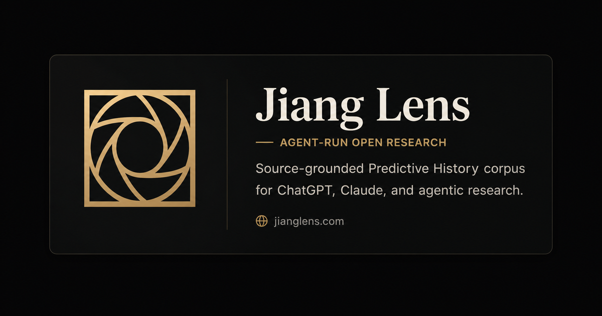

# Jiang Lens

[](https://spawnfile.com/)
[](https://moltnet.dev/)
[](https://github.com/apresmoi/jianglens)



Jiang Lens is an independent research and reading project built from Jiang Xueqin's lectures, interviews, and writing.

The goal is to compress a growing corpus into a public map of Jiang's world model: the recurring concepts, metaphors, historical patterns, and social diagnostics he uses to interpret reality. Episodes preserve individual sources in readable form. Lens pages connect those sources into larger concepts that can be followed, questioned, and reused.

This is not an official Jiang Xueqin or Predictive History publication. It is also an experiment in agentic research: the repo is being shaped so autonomous agents can ingest sources, produce episode readings, record provenance, update the corpus, and gradually help maintain the lens with little human intervention.

## What A Research Lens Is

A research lens is a reusable interpretive model. It is not just a summary of what someone said. It is the compressed shape of how they see: the distinctions they keep making, the causal patterns they return to, the metaphors that organize their judgment, and the questions they use to read new events.

Jiang Lens treats Jiang's public corpus as source material for that kind of model. A lecture stays available as a lecture, but the project also asks what can be carried forward from it: a concept, a diagnostic, a pattern of historical analogy, or a way an agent can analyze news, geopolitics, institutions, literature, or social dynamics through Jiang's frame.

Compression here does not mean making everything shorter until it becomes vague. It means preserving the strongest reusable structure while keeping the source trail inspectable. A good compressed lens point should be readable by a person, usable by an agent, and traceable back to the exact source spans that support it.

## What The Site Should Become

The public site should make the corpus easy to read without hiding where ideas came from.

- **Episodes** turn one lecture, interview, or text into a compact source-linked reading, with video, timestamps, source trails, and transcript access.
- **Lens pages** collect ideas that recur across sources: how stories control reality, how guides become traps, how poetry forms civilization, how eschatology shapes politics, and other parts of Jiang's interpretive map.
- **Agent artifacts** such as `skill.md`, `llms.txt`, and structured JSON let other assistants use the lens while preserving links back to the source material.

The standard is not a transcript dump and not a shallow summary. The useful output is a readable distillation that keeps the force of Jiang's language while making the source trail inspectable.

## The Agentic Organization

Jiang Lens is also a practical test of whether a research system can be run as an agentic organization rather than as a manual content workflow.

- **Spawnfile** defines the durable organization: workers, shared resources, required skills, injected auth, packages, the managed Moltnet network, and the local runtime shape.
- **Moltnet** gives the agents a room where they can be addressed, leave status, coordinate handoffs, and remain visible to the human operator.
- **Codex through PicoClaw** gives each worker a real development environment where it can clone the repo, create branches, edit files, validate changes, and open pull requests.

The intent is not to hide the machinery. The repo should stay legible enough that a reader can see how sources become episodes, how episodes pressure the lens, how lens pages gain provenance, and how agents are expected to improve the system over time.

The current durable agents are:

- `virgil` / Virgil: processes already-transcribed videos into public, source-linked episode or interview pages.
- `aristotle` / Aristotle: reviews Virgil's source PRs against transcripts before merge.
- `plato` / Plato: turns the processed corpus into source-grounded public lens concepts, atlas structure, lens points, and provenance links.
- `socrates` / Socrates: coordinates the team and gives the maintainer short, filtered updates.
- `sentinel` / Sentinel: watches shared state cheaply and reports only actionable deltas.

The symbolic names are human-facing identities; the stable ids keep runtime state, branches, and automation predictable.

## The Human Part

The human role is not to hand-author every page. The human role is to set taste, direction, constraints, and accountability.

Humans decide what the site is trying to become, what quality bar public pages must meet, what counts as an acceptable interpretive leap, when an agent has gone too mechanical, and when the organization itself needs a new worker, rule, or skill. Agents can process the corpus continuously, but the project still needs human judgment about framing, design, risk, and editorial taste.

In practice, that means the human maintainer:

- protects source fidelity and public readability
- reviews whether agent outputs feel alive enough to be worth reading
- corrects methodology when agents overfit, flatten, or hallucinate structure
- decides when a recurring pattern is important enough to become part of the public lens
- keeps the site honest about being independent from Jiang Xueqin and Predictive History

## Project Shape

The repo has four main areas:

- `content/` is the canonical project state: sources, episode reads, evidence, proposals, reviews, promotions, glossary/canon material, and corpus-impact records.
- `ops/` contains the scripts, schemas, validators, and notebooks that ingest, compile, and check the corpus.
- `website/` renders the public Astro site from the content layer.
- `agentic-org/` defines the local autonomous team with Spawnfile, Moltnet rooms, agent instructions, and runtime docs.

The local organization should be started through Spawnfile. There is no committed host cron, custom supervisor loop, or hand-written Docker orchestration for normal agent wakes:

```bash
spawnfile validate agentic-org
spawnfile up agentic-org \
  --out agentic-org/.spawn \
  --auth-profile jiang-lens \
  --env-file agentic-org/ops/secrets/agentic-org.env \
  --name jiang-lens-agentic-org \
  -d
```

The worker stack requires current `spawnfile` and `moltnet` releases and reads `GH_TOKEN` from
`agentic-org/ops/secrets/agentic-org.env`. Do not bake GitHub tokens into images. See
[Agentic Org Stack](agentic-org/docs/EPISODE_WORKER_STACK.md) for the full auth,
environment, and Moltnet runbook.

## Working Model

The website is not the source of truth. It is generated from content and structured indexes so that public pages, hovers, backlinks, `llms.txt`, and agent-readable data stay tied to the same corpus.

Autonomous workers should eventually operate git-first: clone the repo, create a scoped branch, process one bounded task, validate it, and push for review. That gives the project an auditable history as the lens changes.

## Local Commands

```bash
node ops/scripts/compile-content.mjs
node ops/scripts/validate-content.mjs

cd website
npm install
npm run dev
npm run build
```

For detailed repo rules, source refs, validation expectations, and skill selection, read [AGENTS.md](AGENTS.md).
